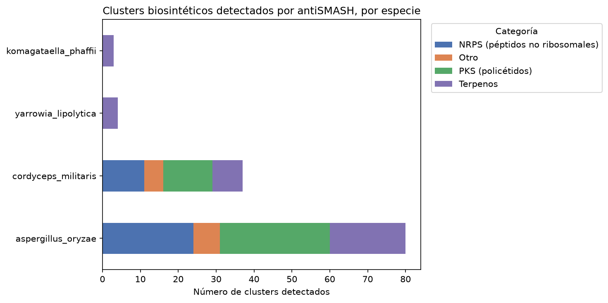

# Genome Mining en hongos: de clusters conocidos a descubrimiento computacional

Pipeline modular y reproducible para identificar clusters de genes biosintéticos (BGCs) en genomas fúngicos, usando dos enfoques complementarios: búsqueda dirigida por homología (BLAST) para rutas metabólicas ya caracterizadas, y descubrimiento computacional (antiSMASH) para detectar clusters candidatos sin conocimiento previo.

## Organismos analizados

| Especie | Método | Resultado |
|---|---|---|
| *Psilocybe cubensis* | BLAST dirigido | Cluster de psilocibina confirmado (PsiD/H/K/M + psiT2), 5 genes en ~14 kb |
| *Cordyceps militaris* | BLAST dirigido + antiSMASH | Cluster de cordicepina confirmado (Cns1-4) + 37 clusters adicionales detectados |
| *Yarrowia lipolytica* | antiSMASH (descubrimiento) | 4 clusters candidatos (terpenos), sin match en MIBiG |
| *Komagataella phaffii* | antiSMASH (descubrimiento) | 3 clusters candidatos (terpenos), sin match en MIBiG |
| *Aspergillus oryzae* | antiSMASH (descubrimiento) | 80 clusters candidatos (PKS, NRPS, terpenos) |



## Motivación

Cuando ya se conoce la ruta biosintética de interés (ej. psilocibina), se puede localizar el cluster comparando el genoma contra secuencias de referencia publicadas. Pero para explorar organismos con metabolismo secundario poco caracterizado, se necesita un enfoque de descubrimiento: antiSMASH escanea el genoma completo buscando patrones de dominios (PKS, NRPS, terpeno sintasas) sin requerir un gen objetivo predefinido.

Este proyecto implementa ambos enfoques en una arquitectura reutilizable, validada en 5 organismos con distinta relevancia biotecnológica: uno psicoactivo de interés farmacológico, uno productor de metabolitos con potencial terapéutico, dos chasis industriales de biología sintética, y uno de uso gastronómico milenario (koji).

## Arquitectura

**genome_mining/**    
├── descarga.py    # Descarga genomas de NCBI por accession    
├── blast_utils.py    #BLAST dirigido contra secuencias de referencia    
├── visualizacion.py    # Extracción de coordenadas y gráficos de clusters    
└── pipeline.py    # Orquestador: analizar_especie(), agregar_especie()    
**config/**    
└── especies.yaml    # Definición de especies y genes de referencia    
**notebooks/**    
└── analisis_psilocybe.ipynb    # Análisis narrado paso a paso    
**resultados/**    
└── {especie}/antismash/    # Reportes de antiSMASH por especie

## Metodología

### Enfoque 1: BLAST dirigido (cuando se conoce el gen de interés)
1. Descarga del genoma anotado desde NCBI
2. Descarga de secuencias de referencia desde UniProt
3. BLASTP contra el proteoma completo
4. Extracción de coordenadas desde GFF3 (considerando múltiples exones)
5. Visualización del cluster con orientación de hebra

### Enfoque 2: antiSMASH (descubrimiento sin conocimiento previo)
1. Descarga de genoma + anotación GFF3
2. Limpieza de features incompatibles (`limpiar_gff_para_antismash`)
3. Ejecución vía Docker: `antismash/standalone`, taxón fungi, anotación génica provista
4. Parseo de resultados JSON para tablas comparativas

## Requisitos

```bash
pip install biopython pandas matplotlib seaborn requests pyyaml jupyter
```

- BLAST+: `brew install blast`
- Docker Desktop + imagen antiSMASH: `docker pull antismash/standalone`
- NCBI Datasets CLI (descarga de genomas)

## Uso

```python
from genome_mining.pipeline import analizar_especie, agregar_especie

# Agregar una especie nueva (busca automáticamente el mejor accession)
agregar_especie(
    nombre_cientifico="Nombre científico",
    genes_interes={"GenA": "UNIPROT_ID", ...}  # opcional
)

# Correr el análisis dirigido completo
coordenadas = analizar_especie("nombre_especie")
```

Para antiSMASH, ver comandos Docker en `notebooks/`.

## Limitaciones y notas honestas

- La selección automática de accession por mejor N50 no siempre coincide con la cepa exacta usada en la literatura (validado con identidad >95% en vez de 100% para Cordyceps).
- antiSMASH con `--taxon fungi` requiere anotación GFF3/GenBank real; no acepta predicción automática de genes (Prodigal) para eucariontes.
- Los clusters "sin match en MIBiG" son candidatos computacionales, no confirmados experimentalmente.

## Referencias

- Fricke, J. et al. (2017). Enzymatic synthesis of psilocybin. *Angewandte Chemie*.
- McKernan, K. et al. (2021). A draft reference assembly of the *Psilocybe cubensis* genome. *F1000Research*.
- Blin, K. et al. (2023). antiSMASH 7.0: new and improved predictions for detection of secondary metabolite biosynthesis gene clusters. *Nucleic Acids Research*.
