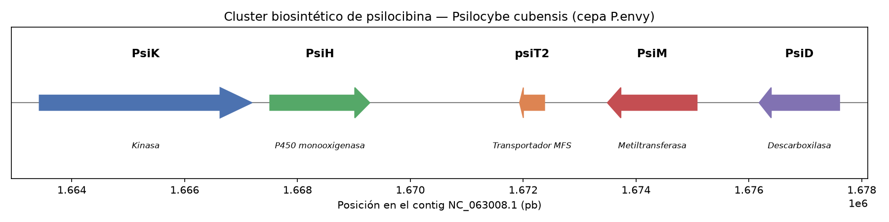

# Genome Mining: Cluster Biosintético de Psilocibina en *Psilocybe cubensis*

Proyecto de bioinformática enfocado en la identificación y visualización computacional del cluster de genes responsable de la biosíntesis de psilocibina en *Psilocybe cubensis* (cepa P.envy), usando datos genómicos públicos.

## Contexto

La psilocibina es un compuesto psicoactivo con investigación farmacológica activa (terapia para depresión y PTSD). Su ruta biosintética fue descrita por primera vez por Fricke et al. (2017), identificando cuatro enzimas clave codificadas en un cluster génico compacto. Este proyecto reproduce y extiende ese hallazgo usando el genoma de referencia de alta calidad publicado por McKernan et al. (2021).

## Objetivo

1. Confirmar computacionalmente la presencia y ubicación del cluster biosintético de psilocibina en el genoma de referencia
2. Verificar la agrupación física (sintenia) de los genes involucrados
3. Visualizar el cluster con sus coordenadas genómicas reales

## Metodología

1. **Obtención de datos**: descarga del genoma anotado de *P. cubensis* cepa P.envy (NCBI RefSeq, accession `GCF_017499595.1`), ensamblado con PacBio HiFi a nivel de cromosoma
2. **Secuencias de referencia**: descarga de las secuencias de proteína de PsiD, PsiH, PsiK y PsiM desde UniProt (accessions P0DPA6–P0DPA9)
3. **Búsqueda de homología**: BLASTP de las secuencias de referencia contra el proteoma completo del genoma descargado
4. **Extracción de coordenadas**: localización de las posiciones genómicas exactas de los genes identificados en el archivo de anotación GFF3
5. **Visualización**: representación gráfica del cluster con matplotlib, mostrando posición, tamaño y orientación de cada gen

## Resultados

Se confirmó la presencia de un cluster de 5 genes en una región de ~14 kb del contig `NC_063008.1`:

| Gen | Función | Posición | Hebra |
|---|---|---|---|
| PsiK | Kinasa | 1,663,425–1,667,194 | + |
| PsiH | P450 monooxigenasa | 1,667,511–1,669,282 | + |
| psiT2 | Transportador MFS | 1,671,937–1,672,379 | − |
| PsiM | Metiltransferasa | 1,673,493–1,675,081 | − |
| PsiD | Descarboxilasa | 1,676,182–1,677,607 | − |

Todos los matches por BLAST fueron de 100% de identidad contra las secuencias de referencia, confirmando su identidad exacta. Adicionalmente al enzimas biosintéticas descritas originalmente, se identificó un gen transportador (psiT2) dentro de la misma región, coherente con reportes posteriores que amplían la definición del cluster.



## Estructura del repositorio

psilocybe-genome-mining/
├── scripts/
│   ├── explorar_genoma.py         # Exploración inicial del ensamblaje
│   ├── descargar_referencias.py   # Descarga de secuencias de referencia desde UniProt
│   └── visualizar_cluster.py      # Generación del diagrama del cluster
├── referencias_psilocibina.fasta  # Secuencias de referencia (PsiD/H/K/M)
├── resultados_blast.tsv           # Resultados del análisis BLAST
├── cluster_psilocibina.png        # Visualización final
└── README.md

## Requisitos

```bash
pip install biopython pandas matplotlib seaborn requests
```

También requiere BLAST+ instalado localmente (`brew install blast` en macOS) y la herramienta `datasets` de NCBI para descarga de genomas.

## Referencias

- Fricke, J. et al. (2017). Enzymatic synthesis of psilocybin. *Angewandte Chemie*.
- McKernan, K. et al. (2021). A draft reference assembly of the *Psilocybe cubensis* genome. *F1000Research*.

## Nota

Este proyecto es de naturaleza estrictamente bioinformática/computacional (análisis de secuencias públicas). No involucra cultivo, síntesis, ni manipulación del organismo.